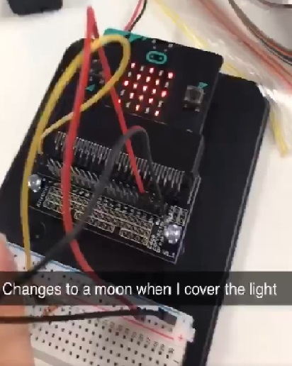

# Inventor Kit Experiments

### Experiment name ###

Experiment 2: USING A LIGHT SENSOR AND ANALOG INPUTS

#### Photo of completed project ####

  

Fig. 1 (left), star image when the light sensor is exposed. Fig. 2. (right) moon image when light sensor is covered.

#### Reflection ####

In this experiment, I began to understand and learn about the phototransistor and resistor. As more light shines on the phototransistor this allows more current to flow and then increases the voltage towards 3V. When there is less light, the resistor helps pull the voltage down to 0V.

This experiment could be the basis of a real world application such as for interactive art and displays where a light sensor is required.

### Experiment name ###

Experiment 3: DIMMING AN LED USING A POTENTIOMETER

#### Photo of completed project ####

 

Fig. 3 (top), LED light is bright when potentiometer is turned anti-clockwise. Fig. 4 (bottom), LED light is dim when potentiometer is turned clockwise.

#### Reflection ####

In this experiment, something I learnt was using the variables (for light state) and pins (analog write to pin, analog read pin, etc). The analog value determines the brightness of the LED. 

This experiment could be the basis of a real world application such as for appliances and setting the brightness on the display for devices.

### Experiment name ###

Experiment 4: USING A TRANSISTOR TO DRIVE A MOTOR

#### Photo of completed project ####

Fig. 5, image of completed experiment. Motor spins slowly after a few seconds and then faster until it reaches a maximum speed before slowing down and stopping. The cycle begins again.

#### Reflection ####

In this experiment, I learnt about the importance of a transistor when adding a motor to a microprocessor like the microbit. It allows more current flow to the components. 

This experiment could be the basis of a real world application for fans and turbines that are required at a certain rate of speed. 

### Experiment name ###

Experiment 5: USING THE ACCELEROMETER TO CONTROL MOTOR SPEED

#### Photo of completed project ####

Fig. 6, the fan motor is spinning fast as the BBC micro:bit is tilt. The more tilted the microbit is the faster the fan motor gets. When the micro:bit was flat, the fan did not spin. 

#### Reflection ####

In this experiment, I learnt that the value of the acceleration block can return a value larger than 1023, but this will not be the case under the effect of Gravity alone. Tilting the micro:bit fowards and backwards gave values between -1023 and 1023 on the Y axis. 

This experiment could be the basis of a real world application such as for a cooling fan that has to be at a certain angle. 

### Experiment name ###

Experiment 6: SETTING THE TONE WITH A PIEZO BUZZER

#### Photo of completed project ###

Fig. 7, when button 'A' is pressed on the micro:bit a brief tone is played, and when button 'B' is pressed it plays a brief lower pitch tone. When both buttons 'A' and 'B' are pressed at the same time the buzzer plays a tune. 

#### Reflection ####

In this experiment, something I learnt was using music blocks and how simple it was to use and program them into the micro:bit. 

This experiment could be the basis of a real world application such as an electronic instrument or musical toy (did someone say the b meowsic keyboard?).
