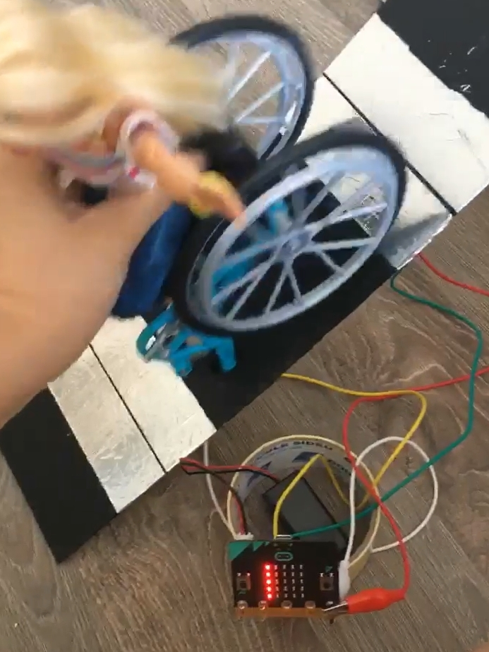
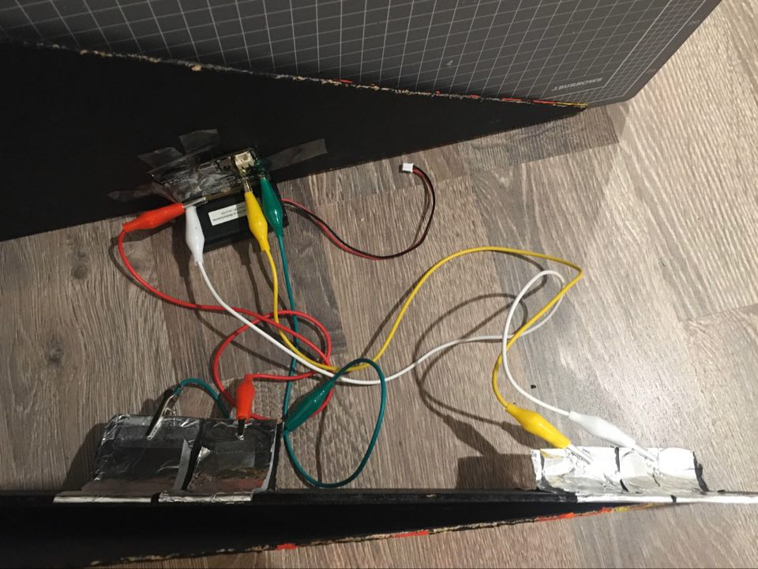

# Assessment 1: Replication project

## Replication project choice ##
Timing Gates

### Related project 1 ###
Sprint Race Timing System with Arduino

https://www.youtube.com/watch?v=q_4-i3iNggE

This project is similar in the way it deals with distance and speed. This system is practical and simple in design. 

### Related project 2 ###
Micro:bit Reaction Game 

https://www.youtube.com/watch?v=DgJ-S0q0EMs

The materials used (cardboard, micro:bit, aluminium foil, alligator clips) and the purpose of said materials is very similar to what I used to create my replication project. Having used a micro:bit for the 'computer' of the project and foil to carry the current of electricity as a means of sensor. 

### Related project 3 ###
Arduino Mate Dispenser

https://www.hackster.io/roni-bandini/arduino-mate-dispenser-17a96d

Although the Arduino Mate Dispenser has a completely different purpose, it shows how sensors can be used in many different ways and what these devices (Arduino, micro:bit etc.) have the potential of doing. 
## Reading reflections ##

### Reading: Don Norman, The Design of Everyday Things, Chapter 1 (The Psychopathology of Everyday Things) ###

What I thought before: Very little as I know not much about design, besides that it should be user friendly (I didn't even know what that actually meant). 

What I learned: The nuances in design and how the brain recognises different functions from our previous experiences using other products. 

What I would like to know more about: Other examples of what is good and bad design in our everyday life. 

How this relates to the project I am working on: It makes me think about my design for my projects. If something is clumsy, how can I signify how it's used or make it better? 

### Reading: Chapter 1 of Dan Saffer, Microinteractions: Designing with Details, Chapter 1 ###

What I thought before: That products have features.

What I learned: That there are more than just features within design, as well as the importance of microinteractions regardless of how subtle (or not) it is and the impact it has on a user's experience. It can make a product more pleasureable and easy to use even if we don't consciously remember that detail. 

What I would like to know more about: Other microinteractions that I use in my day to day life that I don't notice. 

How this relates to the project I am working on: This chapter makes me think about how I could improve my design to be more user friendly and less clunky, and how small things can change the overall experience of a product. 

### Reading: Scott Sullivan, Prototyping Interactive Objects ###

What I thought before: I thought that in order to learn more about programming I'd have to study a relevant course.

What I learned: learning programming is extremely accessible with all the shared information online, and that there are options of other relatively affordable microcontrollers such as the Arduino that makes coding and creating these interactive objects accessible to the average joe. I also learnt that it's viable to learn as you progress and experiment with trial and error. 

What I would like to know more about: The capabilities of microcontrollers such as micro:bit and Arduino, and how I can use them to their potential in creating interactive objects for both this course and for my own enjoyment. 

How this relates to the project I am working on: As I progress through my replication project, the more I realise, like Sullivan I learn more as I go from trial and error than spending a chunk of time doing theory before even starting my endeavours. I've gone through multiple ideas and things that didn't work out, and even after 'finishing' my replication project there is still more I want to expand on and retry. 

## Interaction flowchart ##

 

## Process documentation

I began by making a mock up of the original timing gate project to see how it'd work. 

A bit clumsy, but worked nethertheless and displayed a reading on the micro:bit. However, it wasn't the velocity. 

So, after playing around and testing some of the micro:bit coding I came to this conclusion for it to display the velocity on the micro:bit screen. I found using terms such as "exit_gate" and "enter_gate" rather than just "event timestamp" made it a lot easier to work with. 
Velocity Code

For the wheelchair iteslf, I added foil under the footrest of the wheelchair for the current to pass through to trigger the gates. 

And so, my replication project began. I created some mock up designs of what I had in mind. Something similar to a skateboard ramp..

And then I realised that I lack a whole lot of drawing skill and couldn't really get down what I wanted in paper, so I made a cardboard mockup of the shape I wanted. 

Translated that onto a larger scale on thin wood, assembled it without adhesing together just to see how it'd look.  

Stuck some square dowel onto the middle piece as notches for the ramps

And then began to paint a design on the ramp. Flames would go well with Barbie's aesthetic. 

With the design of my ramp, I wasn't going to be able to have the alligator clips on the side so after some 'very professional' brainstorming, I came up with sticking a bit of carefully ripped cardboard to the bottom of each gate. 

And yay, it worked! I coloured it black to match the ramp, stuck it on and added the double sided tape to secure the foil from the bottom of the ramp. 

I compared my mock up timing gate and my newly made timing gate and clipped on the alligator clips accordingly. 

Gave it a quick whirl..

and it worked!! I cut out a window to fit the micro:bit in the ramp and show the LED display from the inside. I assembled all the pieces of the ramp together, using tape to secure each of ther sides of the ramp to the middle piece and the micro:bit. 

## Project outcome ##

### Speeding Wheelchair Barbie ###
### Project description ###

Speeding Wheelchair Barbie is an interactive model that measures the velocity of a vehicle passing through - the vehicle in this case being a Wheelchair. This is intended to be a novelty interactive toy, but can be applied to a real life scenario if we ever had wheelchairs on the road and had to fine speeders.

### Showcase image ###

### Additional view ###
https://www.youtube.com/embed/pjK1BEW560s

What the inside of the ramp looks like. The ramp is able to be opened to turn the micro:bit on and closes back up. 
### Reflection ###

In order to calculate the velocity I had to do more research into time and distance math as I've retained absolutely nothing from high school. After having found the related projects I realised how basic materials such as foil and cardboard is so versatile in creating prototype projects. 
In the end the ramp did what it was supposed to do - calculate the velocity Wheelchair Barbie went down. But with more time I could've created a more 'finished' looking project. Especially because of the COVID-19 situation, I was unable to spend as much time as I wanted on my replication project but I hope to learn more and develop skills that could allow me to develop my ideas further (a proper on/off button, a better sensor, etc). The sensor in the micro:bit was a bit of a let down as it couldn't detect speeds that was as fast as the acceleration of the ramp itself if I didn't have to hold Barbie. I'd expand more on ways I could make the project more accurate and stable.

I've found the concept of Wheelchair Barbie fascinating for awhile, and when I mentioned this product to a buddy he came up with the idea of putting a Wheelchair Barbie on a drone. I thought it was funny and so I thought about how I could incorporate Wheelchair Barbie into my own projects. I'd like to one day motorise her wheelchair and make it remote controlled. For now I can only dream. 
